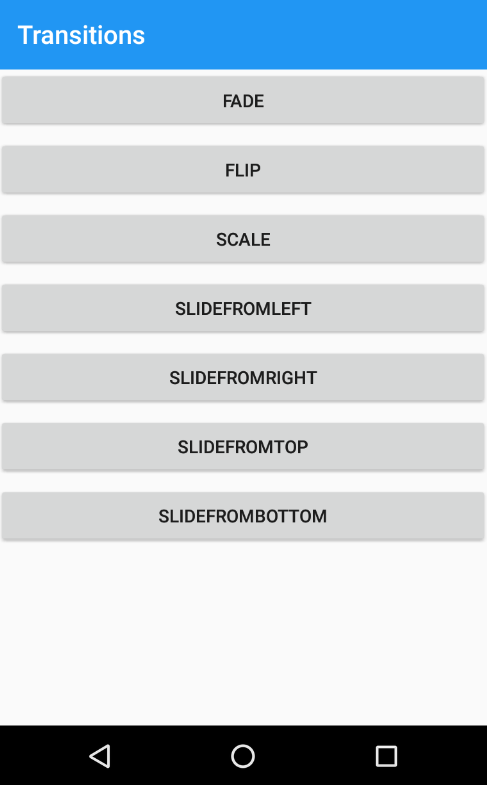
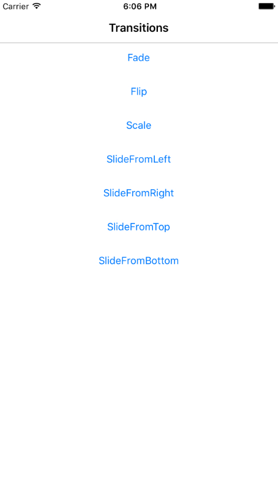
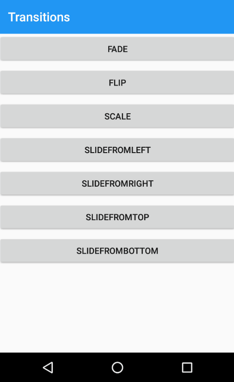
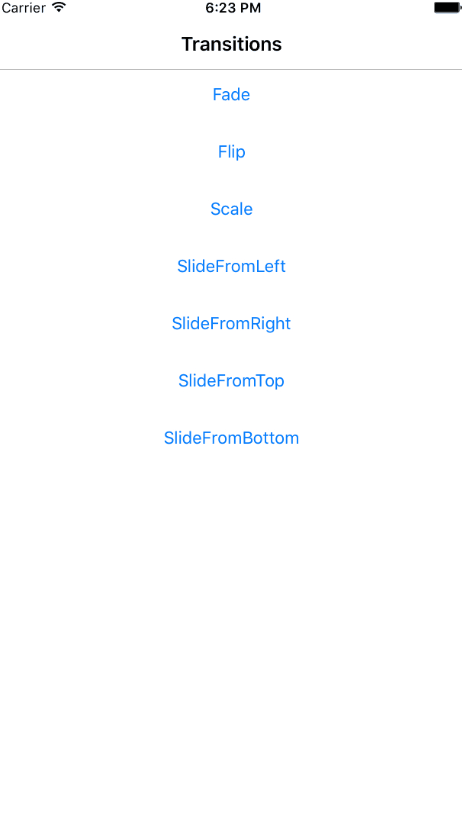
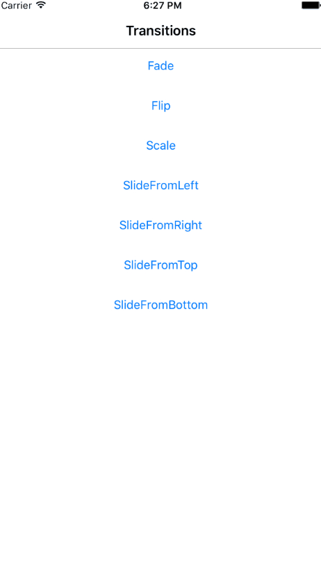
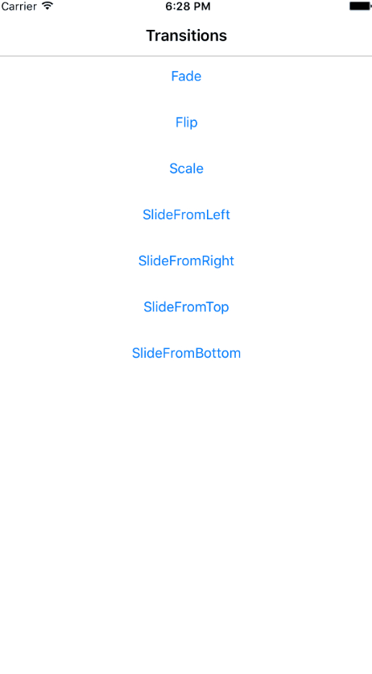
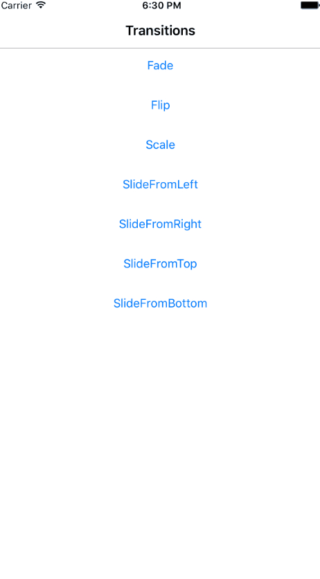

# Xamarin.Forms Page Transitions

Custom page **transitions** in a Xamarin.Forms App.

 

## Transitions

### Fade

 

### Flip

 

### Scale

 

### Slide from left

 

### Slide from right

 

### Slide from top

 

### Slide from bottom

 

## Setup

Download or clone the repository. There are different solutions.

Rebuild the selected solution to get all neccesary NuGet packages.

**Enjoy!**

## Copyright and license

Code released under the [MIT license](https://opensource.org/licenses/MIT).